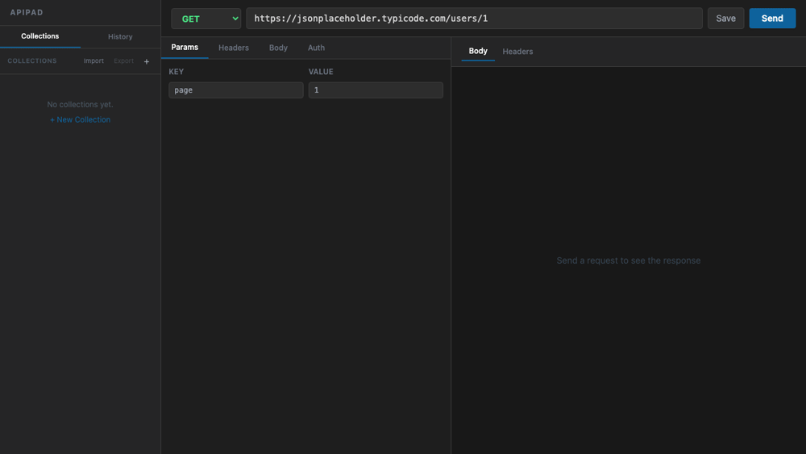
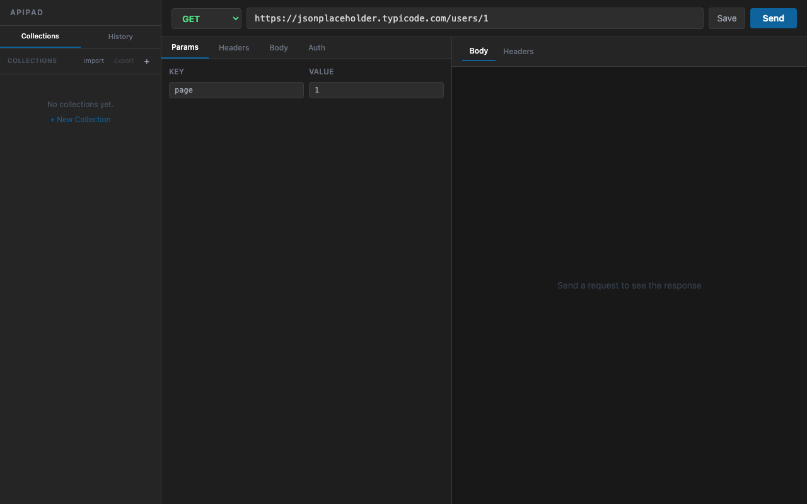

# ApiPad

A lightweight, fast API testing desktop app built with Tauri + React. Think Postman, but minimal and native.

## Features

- **All HTTP methods** — GET, POST, PUT, PATCH, DELETE, HEAD, OPTIONS
- **Request builder** — Query params, headers, and request body
- **Authentication** — No Auth, Basic Auth, Bearer Token, API Key, OAuth 2.0
- **Collections** — Organize requests into collections, save and reload with full config
- **Import / Export** — Export selected collections to `.json`, import them on any machine
- **Postman support** — Import Postman v2.1 collection files directly
- **Request history** — Last 50 requests auto-saved in the sidebar
- **Response viewer** — Pretty-printed JSON body + response headers with status code and time

## Demo



## Screenshot



## Getting Started

### One-command setup

```bash
git clone https://github.com/NiHaLOO7/ApiPad.git
cd ApiPad
./setup.sh
```

The script installs everything you need — Node.js 18+, Rust, and Linux system dependencies (if needed) — then runs `npm install`. Works on macOS and Ubuntu/Debian.

### Run in development

```bash
npm run tauri dev
```

### Build for production

```bash
npm run tauri build
```

The installer will be in `src-tauri/target/release/bundle/`.

### Manual prerequisites

If you prefer to install manually:

- [Node.js](https://nodejs.org/) v18+
- [Rust](https://www.rust-lang.org/tools/install) (stable)
- [Tauri prerequisites](https://tauri.app/start/prerequisites/) (Linux only: WebKit + system libs)

## Collections

Collections let you group related API requests together and share them with your team.

**Create:** Click `+` in the sidebar → give it a name → start saving requests into it.

**Save a request:** Configure your request → click **Save** in the top bar → pick a name and collection.

**Export:** Click **Export** in the sidebar → select which collections → native Save dialog opens → pick where to save.

**Import:** Click **Import** → select a `.json` file — supports both ApiPad format and Postman v2.1.

### Export format

```json
{
  "apipad_version": "1.0",
  "collections": [
    {
      "name": "User Service",
      "requests": [
        {
          "name": "Get all users",
          "method": "GET",
          "url": "https://api.example.com/users",
          "headers": [],
          "params": [],
          "body": "",
          "auth": { "type": "Bearer Token", "bearerToken": "..." }
        }
      ]
    }
  ]
}
```

## Tech Stack

- [Tauri v2](https://tauri.app/) — native desktop shell
- [React 19](https://react.dev/) — UI
- [Tailwind CSS v3](https://tailwindcss.com/) — styling
- [Vite](https://vitejs.dev/) — build tool
- `tauri-plugin-http` — bypasses browser CORS for real HTTP requests
- `tauri-plugin-dialog` — native Save / Open file dialogs
- `tauri-plugin-fs` — write files to disk

## License

MIT
